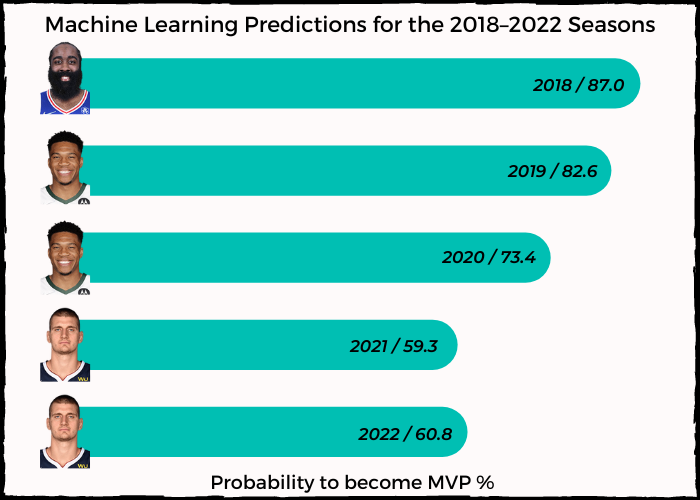

# NBA_MVP
### ➭ Predicting the last 5 (2018-2022) NBA MVP's using Machine Learning. 

The Most Valuable Player Award (MVP) is an annual National Basketball Association (NBA) award given to the top-performing player of the regular season since the 1955-56 season. I use historical data surrounding an NBA player's basketball season to predict the last 5 MVPs (2018-2022).
My regression model correctly predicted all MVPs!
But what are the stats (features) that have allowed my model to perform so well?

The following picture shows all the work steps that are carried out. I usually combine these steps in a fully automated pipeline, but since this is a side project and my free time is limited, the pipeline is split into 3 files that are executed sequentially.

##### ➤ 1 'nba_html_crawler.ipynb':
- Parse selected Basketball-Reference (Website) pages and save all relevant pages in html-format. 
- [Basketball-Reference](https://www.basketball-reference.com/)

##### ➤ 2 'nba_html_to_mongodb.ipynb':
- Aggregate the data from the html pages and upload it to my MongoDB Cloud account.

##### ➤ 3 'nba_ml.ipynb':
- Predict the last 5 (2018-2022) NBA MVPs with Machine Learning.

##### ➤ Additional 'dashboard.pbix': 
- PowerBI file with a three charts, all three are featured in the 'nba_ml.ipynb' file. 

----
## Results: 
### ➭ (For detailed information analyse the 'nba_ml.ipynb' file)  

 To my delight, I managed to predict all 5 MVPs using an XGBoost regressor. I was also able to use SHAP to examine the regressor's decision-making process. The two following diagrams show the results of the detailed model investigation. Since my time is limited, just a little hint on how to interpret the plots.

#### Hint 1/2 for both images: The feature with the greatest impact on the regressor is at the top. The feature, WS (= Win Share = is a metric that estimates the number of wins a player produces for his team throughout the season), is at the top. It follows that WS has the biggest influence on the regressor and its prediction.
#### Hint 2/2 for the second pictures: Here the individual features are now examined exactly according to their size.

#### The XGBoost will predict a higher mvp share score if...
- the feature 'WS' have a high value. -> (the number of wins a player produces for his team throughout the season)
- the feature 'WS/48' have a high value. -> (the number of wins a player produces for his team throughout the season aggregated in 48min, Game = 48min)
- the feature 'OBPM' have a high value. -> (the advanced Offensive Box Plus/Minus state show how good/valuable a player is for his team's offense)
- the feature 'Rk_Conference' have a low value. -> (the team has excelled performed in the regular season --> a low number in the conference: 1 from 15 teams)

----
#### Two PowerBI Charts
#### Heat Table 
Now two PowerBi charts follow. The heat table shows the top 10 players ranking for MVP shares in a season. Furthermore, the 10 most important features are color-coded according to their size. This clearly shows what differentiates a Nikola Jokic, the mvp of the 2022 season, from the other players. 
  

----
#### Compare Chart:
The compare chart now compares the real values of the mvp choice with those predicted by the model. On the one hand, it is noticeable that the predicted values for the top 3 players do not come close to the real values of the election. On the other hand, players who received only a few votes in the election do much better in the model. This can all be explained with the voting system. Since I don't want to explain the whole voting system here, only a short summary follows.

Statistically speaking, many players are having a very good season. So they should be closer together in the MVP pick if only those stats were considered. But the voting system works differently. This means that a player who was the MVP for a person receives significantly more points than a player who only ends up in 3rd place. In reality, there is only a minimal difference between the places - but the points awarded speak a different language.

Nevertheless, the model can correctly determine the MVP and usually also the top 3 players of a season.
The charts for each season as well as the chart of all MVP votes ranked can be found in the 'nba_ml.ipynb' file.
  

  
## Programming Language & Tools
- Python
- Pandas, Numpy, Scikit-Learn, SHAP
- MongoDB Cloud
- PowerBI

## Feedback & Questions

If you have any feedback, please check out my email adress on my website or connect with LinkedIn. 

## 🔗 Links from the Author(Me)
[Portfolio/Website](https://thejk.de/) 
[LinkedIn](https://www.linkedin.com/in/jk05/)

